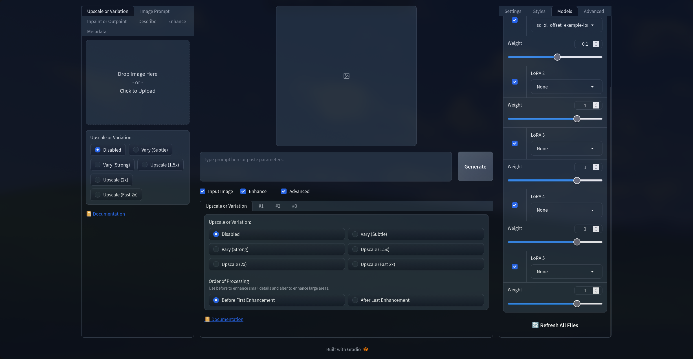
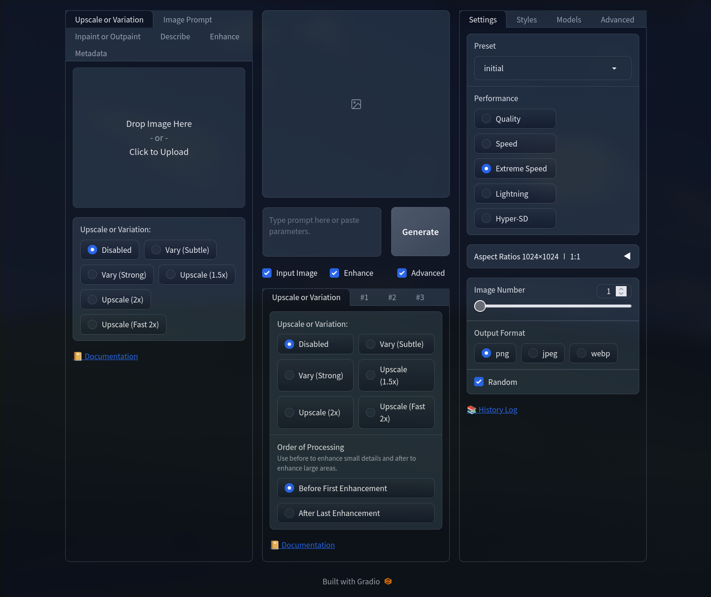
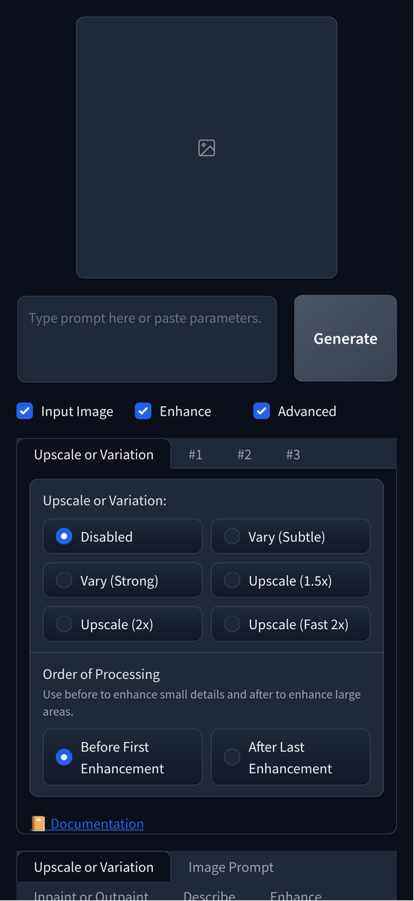

# Fooosti - Fast Fooocus API

Fooosti is a self-hosted fork of [Fooocus](https://github.com/lllyasviel/Fooocus), tuned to run as a lightweight background service in Docker. It keeps the familiar Fooocus image quality and UI, and adds a clean HTTP API on top.

## Why a fork?

- **Runs idle for almost nothing.** Generation happens in a separate subprocess that is spawned per task and torn down when done, so the main process sits nearly idle in between — no tens of gigabytes pinned in VRAM while you do nothing else on the GPU.
  - The worker lifetime is controlled by `FOOOSTI_KEEPALIVE_MINUTES` in `docker-compose.yml` (`0` = unload the worker after every task).
- **A real API.** FastAPI server on port `8890` with A1111-compatible `/sdapi/v1/*` endpoints — so it plugs straight into [Open WebUI](https://github.com/open-webui/open-webui) (or any other A1111 client) as a drop-in backend. See [API.md](API.md) for endpoints, request templates and auth.
- **Local prompt translation & enhancement.** Non-English prompts are rewritten into detailed English SD prompts by a local LLM — **Qwen2.5-1.5B-Instruct-abliterated**, downloaded from [HuggingFace](https://huggingface.co/huihui-ai/Qwen2.5-1.5B-Instruct-abliterated). Works on top of the stock Fooocus V2 expansion. Fully configurable via `config.txt`: `enable_prompt_translator` disables it entirely, `prompt_translator_enhance_english` also enhances English prompts.
- **Redesigned UI.** Custom CSS and JS on top of the Gradio interface, UI settings persisted across restarts.

## Screenshots

| Fullscreen | Medium screen | Mobile screen |
|------------|---------------|---------------|
|  |  |  |

## Quick start (Docker)

Requirements: Nvidia GPU with proprietary drivers + Docker with the NVIDIA Container Toolkit.

```sh
mkdir -p ~/Fooosti
cd ~/Fooosti
docker compose up -d --build
```

- Web UI (Gradio): http://localhost:7865
- API (FastAPI): http://localhost:8890 (interactive docs at `/docs`)
- Data lives on the persistent `./data:/content/data` volume — checkpoints, LoRAs, outputs, config and the translator model survive container rebuilds.

Drop `.safetensors` checkpoints into `data/models/checkpoints/`, press **Refresh All Files** in the UI (Models tab, bottom of the right column), and you're done.

## Auth

The API can be locked with `FOOOSTI_API_TOKEN` in `docker-compose.yml`. When set, every `/sdapi/v1/*` request must send the token in the `x-api-token` header. Empty token = unauthenticated. Details: [API.md](API.md#authentication).

## License

GPL-3.0 — inherited from the upstream [lllyasviel/Fooocus](https://github.com/lllyasviel/Fooocus). See [LICENSE](LICENSE).
